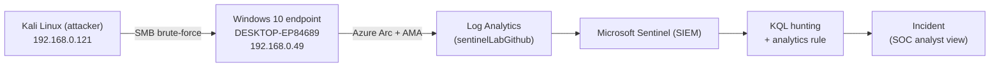
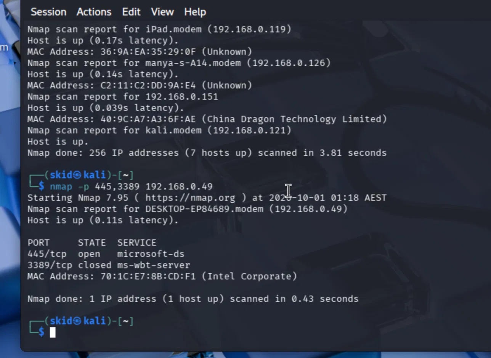
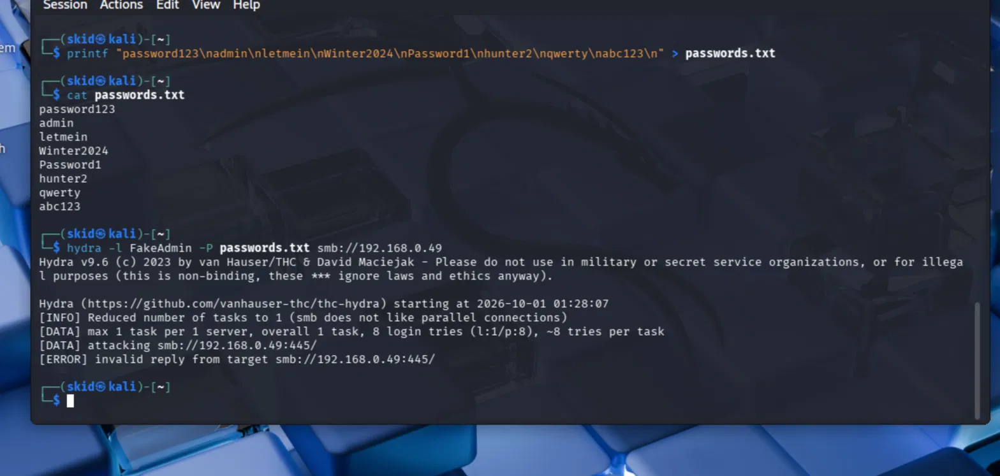
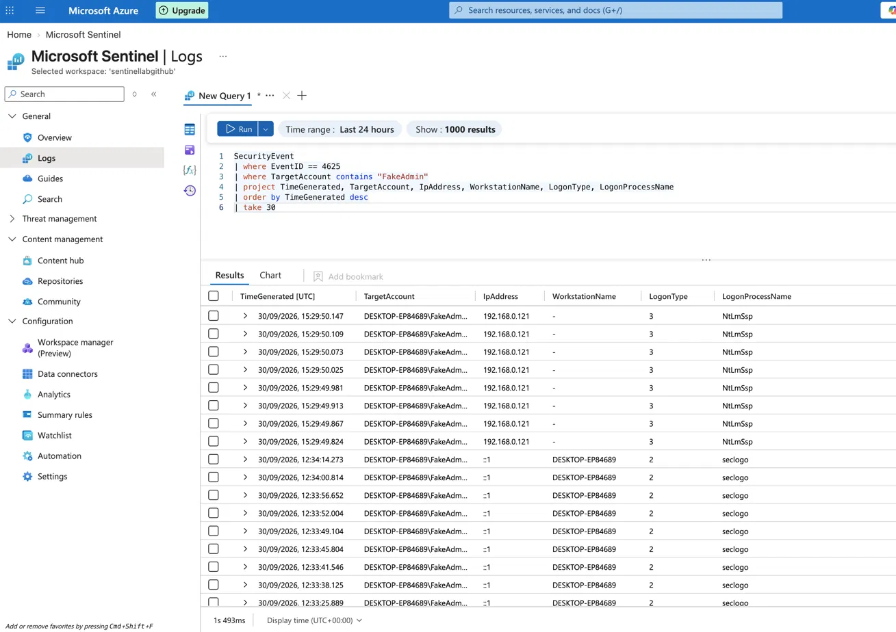
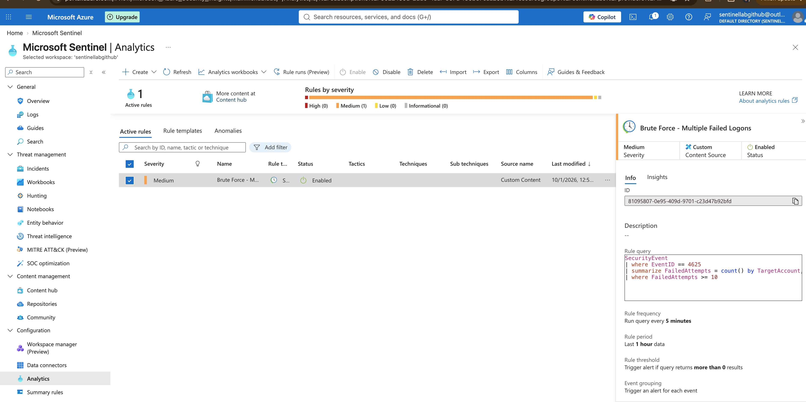

# Module 01 — KQL Threat Hunting in Microsoft Sentinel

Detecting a remote SMB brute-force attack against a live Windows endpoint, from network
discovery through to a SIEM detection.

This module builds the data pipeline for the whole lab, executes a real network attack from
a Kali host, and uses KQL to hunt and detect it inside Microsoft Sentinel. It ends with a
scheduled analytics rule that turns the manual hunt into an automated detection.

---

## What this module demonstrates

- Onboarding a physical Windows endpoint to Azure with **Azure Arc**
- Streaming Windows Security events into a Log Analytics workspace via the **Azure Monitor Agent (AMA)** and a **Data Collection Rule (DCR)**
- Adversary emulation of an internal attack chain: **network discovery -> service enumeration -> credential brute-force**
- Writing **KQL** to hunt authentication activity and distinguish local from network-sourced attacks
- Converting a hunt into a **scheduled analytics rule** with entity mapping
- Mapping the activity to **MITRE ATT&CK**

---

## Lab architecture



| Component | Value |
|---|---|
| Attacker | Kali Linux VM, `192.168.0.121` |
| Target endpoint | Windows 10 Home, `DESKTOP-EP84689`, `192.168.0.49` |
| Data source | Windows Security Events via AMA |
| Collection level | Common |
| Table | `SecurityEvent` |
| Workspace | `sentinelLabGithub` (East US) |

---

## Data source setup (summary)

1. Created a Log Analytics workspace and enabled Microsoft Sentinel.
2. Installed the **Windows Security Events** solution from the Content hub.
3. Onboarded the endpoint with **Azure Arc** (Connected Machine Agent) - an on-prem laptop now appears in Azure as a managed resource.
4. Created a **Data Collection Rule** (`dcr-windows-security-events`) via the **Windows Security Events via AMA** connector, set to **Common**, attached to the endpoint.
5. Verified ingestion with `SecurityEvent | take 10`.

> **Note on data source:** the public Log Analytics demo workspace this lab originally
> targeted was retired under Microsoft's Secure Future Initiative. Rather than depend on a
> shared demo tenant, the lab uses a self-hosted endpoint as its data source - closer to
> how a real SOC ingests endpoint telemetry.

---

## Attack chain (adversary emulation)

All activity was performed on hardware I own, on my own isolated home network. This mirrors
how a real intruder behaves *after* gaining an internal foothold (e.g. via phishing): the
attacker does not know the target's IP in advance - they discover it.

### 1. Host discovery - MITRE T1018
```bash
nmap -sn 192.168.0.0/24
```
Swept the subnet for live hosts. The target appeared as `DESKTOP-EP84689 (192.168.0.49)`.

### 2. Service enumeration - MITRE T1046
```bash
nmap -p 445,3389 192.168.0.49
```
Result: `445/tcp open (microsoft-ds)`, `3389/tcp closed`. SMB is exposed; RDP is not
(expected on Windows 10 Home, which has no RDP server). SMB (445) became the attack vector.

### 3. Credential brute-force - MITRE T1110
```bash
nxc smb 192.168.0.49 -u FakeAdmin -p passwords.txt
```
NetExec fingerprinted the host (`Windows 10 ... signing:False, SMBv1:False`) and attempted
8 passwords against `FakeAdmin`. Every attempt returned `STATUS_LOGON_FAILURE` - each one a
failed-logon event (4625) on the endpoint, generated remotely over the network.

---

## Detection (KQL hunting)

Queries live in [`/queries`](./queries).

### Confirming the attack and its source
The key hunt distinguishes the network attack from earlier local test logons:

```kql
SecurityEvent
| where EventID == 4625
| where TargetAccount contains "FakeAdmin"
| project TimeGenerated, TargetAccount, IpAddress, WorkstationName, LogonType, LogonProcessName
| order by TimeGenerated desc
```

The results clearly separate two attack vectors against the same account:

| Attack | IpAddress | LogonType | LogonProcessName | Meaning |
|---|---|---|---|---|
| Remote SMB brute-force (NetExec) | `192.168.0.121` | 3 (Network) | `NtLmSsp` | NTLM auth over SMB from the Kali host |
| Local test attempts (`runas`) | `::1` | 2 (Interactive) | `seclogo` | Logon at the console of the machine itself |

The `192.168.0.121` / LogonType 3 / NtLmSsp signature is the evidence that a **remote**
credential attack occurred and was captured end to end: attacker -> endpoint -> agent ->
DCR -> Sentinel.

### Brute-force detection logic
```kql
SecurityEvent
| where EventID == 4625
| summarize FailedAttempts = count() by TargetAccount, Computer, bin(TimeGenerated, 1h)
| where FailedAttempts >= 10
```

---

## From hunt to detection

The logic above was promoted into a **scheduled analytics rule**:

| Setting | Value |
|---|---|
| Rule name | Brute Force - Multiple Failed Logons |
| Severity | Medium |
| Tactic | Credential Access |
| Logic | 10+ failed logons (4625) against one account on one host within an hour |
| Schedule | Runs every 5 minutes, looks back 1 hour |
| Entity mapping | Account = `TargetAccount`, Host = `Computer` |

When the threshold is crossed, Sentinel raises an **incident** with the mapped account and
host - one investigable item for the SOC analyst instead of raw log lines.

---

## MITRE ATT&CK mapping

| Tactic | Technique | ID | Evidence in this lab |
|---|---|---|---|
| Discovery | Remote System Discovery | T1018 | `nmap -sn` subnet sweep |
| Discovery | Network Service Discovery | T1046 | `nmap -p 445,3389` port scan |
| Credential Access | Brute Force | T1110 | NetExec SMB password spray; 4625 events |
| Lateral Movement | Remote Services: SMB | T1021.002 | Network logons (Type 3) over SMB/NTLM |

---

## Findings

| Observation | Evidence |
|---|---|
| Target discovered on the subnet |  |
| SMB (445) open, RDP (3389) closed |  |
| NetExec used to attempt remote SMB authentication |  |
| Failed logon events captured in Sentinel from the attack source |  |
| Analytics rule created and configured for repeated logon failures |  |
| Alert generated in the Microsoft Sentinel portal |  |
| Detection details reviewed in the investigation view |  |
| Incident reviewed and closed as a true positive |  |

These images match the actual sequence used in the lab: discovery, enumeration, brute-force, detection, and investigation.

---

## Key observations (talking points)

- **Local vs network logons.** The same account was attacked two ways; the logs distinguish
  them by LogonType (2 = interactive/local, 3 = network) and LogonProcessName
  (`seclogo` vs `NtLmSsp`). Reading those fields is how an analyst tells a keyboard attacker
  from a remote one.
- **Why SMB, not RDP.** Windows 10 Home has no RDP server, so port 3389 was closed. The
  attack surface dictated the technique - enumerate first, then attack what is actually open.
- **Discovery precedes attack.** The target IP was not known in advance; it was found with
  nmap, the way a real intruder maps a network after gaining a foothold.

---

## Skills demonstrated

Data pipeline design (Arc -> AMA -> DCR -> Sentinel) - adversary emulation (nmap, NetExec) -
KQL (`where`, `summarize`, `bin`, `project`, `order by`) - log analysis (logon types, auth
protocols, source attribution) - detection engineering - entity mapping - MITRE ATT&CK.