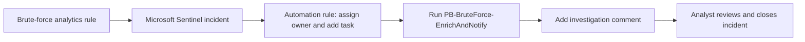
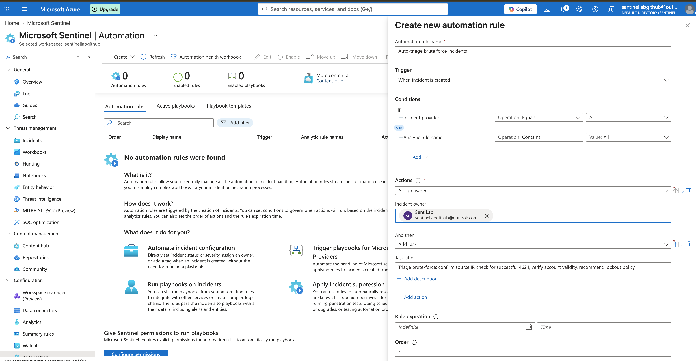
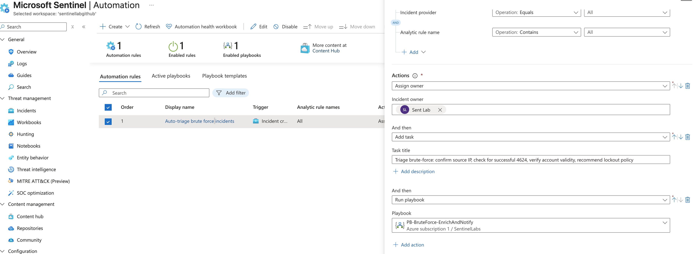
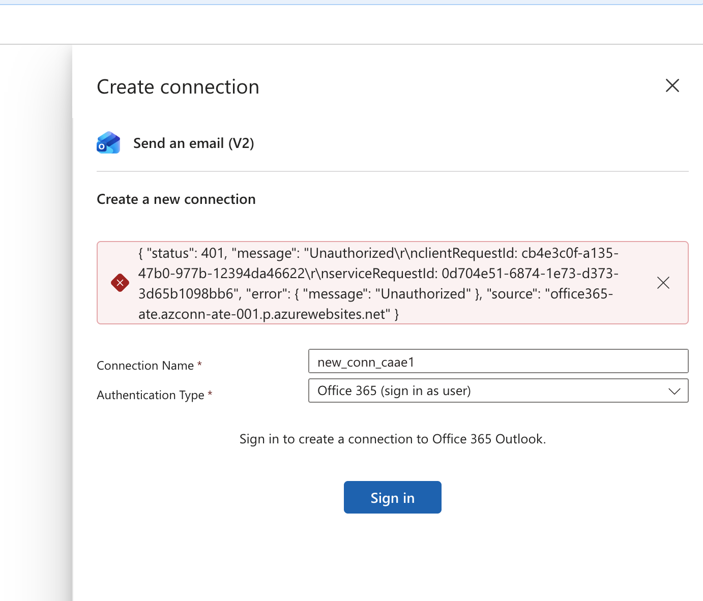
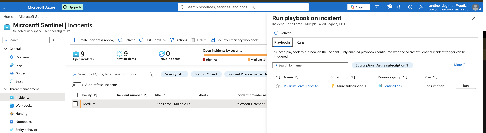
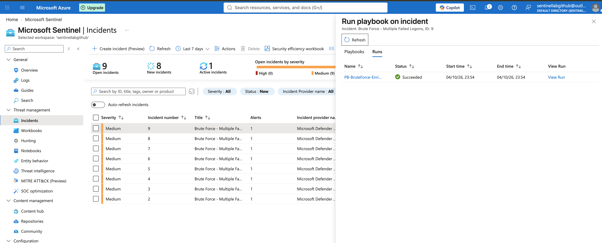
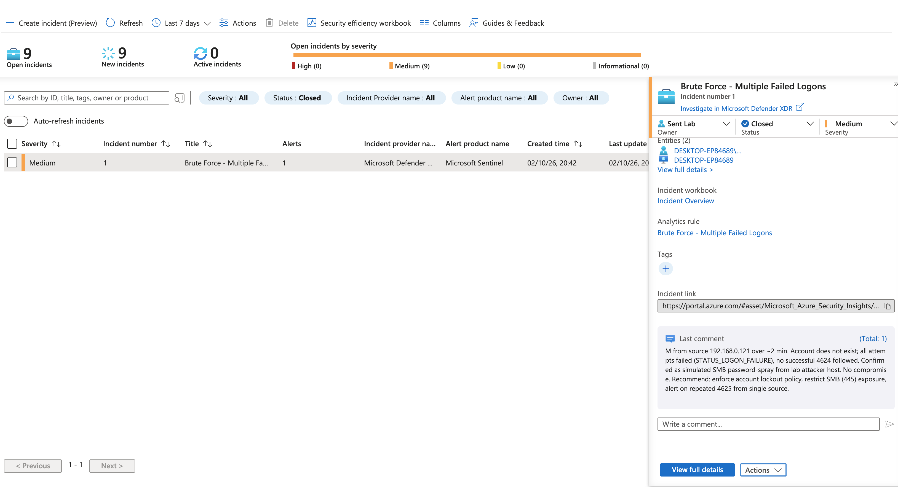

# Module 02 — SOAR: Automating Incident Triage in Microsoft Sentinel

This module extends the brute-force detection built in Module 01. I configured a Microsoft Sentinel automation rule to assign an owner, add a triage task, and start a Logic Apps playbook. The playbook adds investigation guidance to the incident as a comment.

The work demonstrates how Sentinel's built-in automation rules and Logic Apps playbooks can reduce repetitive triage work, while keeping an analyst responsible for investigation and disposition.

## Objective

The goal was to make a brute-force incident easier to investigate by preparing it with an owner, a checklist, and a contextual note. The workflow was tested with incidents named **Brute Force - Multiple Failed Logons** in the `sentinellabgithub` workspace.

## Workflow

An automation rule handles incident-management steps in Sentinel. A playbook is a Logic App used for additional workflow actions. In this lab, the automation rule was configured to assign the incident to **Sent Lab**, add a brute-force triage task, and run `PB-BruteForce-EnrichAndNotify`.

## Automation rule

The rule was named **Auto-triage brute force incidents** and configured to run when an incident is created. Its actions are:

| Action | Configuration |
|---|---|
| Assign owner | Sent Lab |
| Add task | Confirm the source IP, check for a successful Event 4624, verify the account, and consider an account lockout policy |
| Run playbook | `PB-BruteForce-EnrichAndNotify` |

The rule editor screenshot shows the analytic-rule-name condition as **Contains / All**. If the intended behavior is to run this workflow only for brute-force incidents, the condition should be restricted to **Brute Force - Multiple Failed Logons** and then verified on a newly created incident. This report does not treat the screenshot alone as proof that the rule is filtered to that analytic rule.

## Playbook and enrichment

`PB-BruteForce-EnrichAndNotify` is a Logic App intended to receive a Microsoft Sentinel incident and add a comment to it. The triage guidance asks the analyst to review the account and host entities, look for a successful logon after the failures, and consider practical mitigations such as an account lockout policy and limiting unnecessary SMB exposure.

The playbook uses a managed identity to authenticate to Azure resources rather than storing a user password in the workflow. During troubleshooting, the identity needed permission to write incident comments. The Microsoft Sentinel Responder role was assigned at the `SentinelLabs` resource-group scope. A separate `400 BadRequest` caused by a missing Incident ARM ID was resolved by adding the incident's ARM ID dynamic value to the action.

## Testing and results

I opened the Sentinel incident's **Run playbook** panel and selected `PB-BruteForce-EnrichAndNotify`. The run history screenshot records a **Succeeded** run against incident #9. The incident #1 screenshot shows the brute-force incident in **Closed** status with the triage comment visible.

Together, these captures show that the playbook can be started from an incident, complete successfully, and that triage guidance is present on an incident. The run panel capture is a manual launch, so it does not by itself prove the automation rule automatically started the playbook. A further test with a newly created incident is needed to confirm that the rule condition and automatic invocation work end to end.

## Troubleshooting and design decision

| Issue | What happened | Resolution or decision |
|---|---|---|
| `403 Forbidden` while adding an incident comment | The Logic App managed identity did not have sufficient Sentinel permissions. | Granted Microsoft Sentinel Responder to the managed identity at the `SentinelLabs` resource-group scope. |
| `400 BadRequest` — Incident ARM ID missing | The comment action did not receive the target incident's ARM ID. | Added the Incident ARM ID dynamic value to the action and saved the workflow. |
| `401 Unauthorized` from Office 365 Outlook | The **Send an email (V2)** connector could not authenticate with the account used for this lab. | Left email notification out of the working workflow. It can be added later in a tenant with a supported Microsoft 365 mailbox and connector authorization. |

The 401 error is useful evidence of a connector prerequisite: the Outlook action requires an account and authorization supported by the connector. Removing it kept the Sentinel comment workflow testable without making email a dependency.

## Evidence

The screenshots below are the captures collected during the work, renamed to describe what each one shows.

### Rule configuration

The creation form shows the rule name, incident-created trigger, condition controls, and the owner/task actions being configured.

The configured actions show the selected owner, brute-force triage task, and the playbook to run.

### Connector limitation

The Outlook connection dialog returned `401 Unauthorized`. Email notification was therefore excluded from the tested workflow.

### Playbook test and incident result

This capture shows the playbook selection panel for a brute-force incident. It documents a manual test launch.

The run history shows `PB-BruteForce-EnrichAndNotify` completed with **Succeeded** for incident #9.

The incident panel shows incident #1 in **Closed** status and displays the investigation comment, including the simulated source address, unsuccessful authentication attempts, and recommendations.

## Lessons learned

- Use automation rules for routine incident management, and use playbooks for workflow actions that need a Logic App.
- A playbook's managed identity must have the permissions required by its Sentinel actions; verify scope and role assignments when a run returns `403`.
- Required incident context, such as the Incident ARM ID, must be mapped into the playbook action.
- Validate the automation rule's actual condition and test it with a newly created matching incident. A successful manual playbook run is valuable, but is not evidence that the automation rule triggered it automatically.
- Keep optional connectors, such as email, separate from the core workflow until their account and authentication requirements are satisfied.

## Skills practiced

Microsoft Sentinel automation rules · Logic Apps playbooks · incident-triggered workflows · managed identity and Azure RBAC · incident enrichment · connector troubleshooting · verification of SOAR run history.
