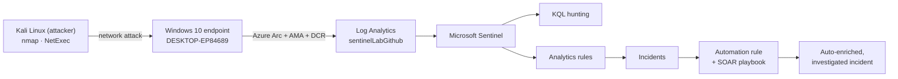

# Microsoft Sentinel SOC Lab — Detection Engineering & Incident Response

A hands-on Microsoft Sentinel lab that builds a complete detect-and-respond pipeline against
a **real, self-hosted Windows endpoint** — from log ingestion, through adversary emulation
and KQL detection engineering, to automated SOAR response and full incident investigation.

Unlike labs built on Microsoft's sample data, every detection here fires on **live telemetry
from a physical endpoint under genuine attack** from a Kali Linux host, so each alert,
entity, and timeline is real.

> Built to demonstrate the skills covered by **Microsoft SC-200 (Security Operations
> Analyst)**: ingest, detect, investigate, respond, hunt, and automate in Microsoft Sentinel.

---

## At a glance

| | |
|---|---|
| **Platform** | Microsoft Sentinel (SIEM + SOAR) on Azure Monitor / Log Analytics |
| **Data source** | Physical Windows 10 endpoint, onboarded via **Azure Arc + Azure Monitor Agent** |
| **Adversary emulation** | Kali Linux (nmap, NetExec) — real attacks over the network |
| **Detections** | KQL hunting queries + scheduled analytics rules with entity mapping |
| **Automation** | Sentinel automation rule + Logic App playbook (managed identity + RBAC) |
| **Framework** | MITRE ATT&CK mapping across discovery, credential access, lateral movement |

**Scope delivered:** a full internal attack chain across **3 kill-chain stages**, detected by
**KQL + scheduled analytics rules** mapped to **MITRE ATT&CK**, with **automated incident
enrichment** and a **documented investigation** of a pass-the-hash / lateral-movement scenario.

---

## Architecture

---

## Modules

| # | Module | What it demonstrates |
|---|---|---|
| 00 | [Environment](./00-environment) | Onboarding a physical endpoint to Sentinel via Azure Arc + AMA + a Data Collection Rule |
| 01 | [KQL Hunting & Attack Emulation](./01-kql-hunting) | Full attack chain (nmap → NetExec) + KQL to hunt and attribute it |
| 02 | [Detection Engineering & Analytics Rules](./02-analytics-rules) | Scheduled rules with hypotheses, thresholds, and false-positive tuning |
| 03 | [Watchlists](./03-watchlists) | Enriching detections with known-bad IPs and high-value accounts |
| 04 | [Workbooks](./04-workbooks) | A visual SOC dashboard over endpoint telemetry |
| 05 | [Threat Intelligence](./05-threat-intelligence) | Matching endpoint logs against threat-intel indicators |
| 06 | [Incident Investigation](./06-incident-investigation) | Full analyst investigation of a pass-the-hash / lateral-movement scenario |
| 07 | [SOAR Automation](./07-automation-playbooks) | Automation rule + playbook that auto-triage and enrich incidents |
| 08 | [MITRE ATT&CK Mapping](./08-mitre-mapping) | Detection-to-technique coverage and gap analysis |

---

## Attack chain emulated

All activity was performed on hardware I own, on an isolated home network — mirroring how a
real intruder behaves after gaining an internal foothold (the attacker discovers the target
rather than knowing it in advance).

| Stage | MITRE | Action | Detected |
|---|---|---|---|
| Discovery | T1018 / T1046 | `nmap` subnet sweep + port scan; found target, SMB(445) open, RDP(3389) closed | ✔ |
| Credential Access | T1110 | `NetExec` SMB password-spray against the endpoint | ✔ |
| Lateral Movement | T1021.002 / T1550.002 | NTLM auth over SMB (network logons, Type 3) | ✔ |

---

## SC-200 domain coverage

| SC-200 domain | Where in this lab |
|---|---|
| Manage a security operations environment | Module 00, 07 (Arc onboarding, automation rules, RBAC) |
| Configure protections & detections | Module 02, 03, 05 (analytics rules, watchlists, threat intel) |
| Manage incident response | Module 06, 07 (investigation, SOAR enrichment) |
| Threat hunting (KQL) | Module 01, 04 (hunting queries, workbooks) |

---

## Note on data source

This lab originally targeted Microsoft's public Log Analytics demo workspace, which was
retired under Microsoft's Secure Future Initiative. Rather than depend on shared sample
data, the lab was rebuilt around a **self-hosted endpoint** as its data source — closer to
how a real SOC ingests endpoint telemetry, and the reason every artifact here reflects a
real attack rather than canned data.

---

## Skills demonstrated

Microsoft Sentinel · Azure Arc / Azure Monitor Agent · KQL (hunting + detection
engineering) · scheduled analytics rules & false-positive tuning · watchlists · workbooks ·
threat intelligence · incident investigation · SOAR (Logic Apps, managed identity, Azure
RBAC) · adversary emulation (nmap, NetExec) · MITRE ATT&CK mapping.